---
documentclass:
    - ctexart
title: sgemm 优化
mainfont: Source Han Sans
author: 陈嘉杰 \quad 计研二一 \quad 2021310745
---

# sgemm 优化


TL; DR: 优化后的 sgemm 在 96 个不同大小的方阵上性能（26.51 GFlops）在平均意义上接近（98.9%） OpenBLAS 实现性能（26.81 GFlops）

## 理论分析

首先考虑 Kunpeng 920 的 CPU 型号 TaiShan 的理论单精度峰值性能：2.6 GHz * 2 FIPC * 4 S-FMA * 2 = 41.6GFlops，其中各项含义如下：

1. 主频：2.6GHz
2. 浮点指令的吞吐率：2 Floating IPC
3. 浮点乘加的并行度：128 位，4 个单精度计算
4. 乘加运算算两个浮点计算：2

运行 OpenBLAS 实现跑出来的性能是 26.81 GFlops（见 `benchmark-blas.log`），达到了峰值性能的 64%。

## 实现过程

优化后的最终版本在 `sgemm-blocked.c` 文件中，输出的性能信息在文件 `benchmark-blocked.log` 文件中，通过 `run.sh benchmark-blocked` 得到，运行 `python3 results.py` 可以看到 96 个矩阵平均性能是 26.51 GFlops，接近 OpenBLAS 的实现。

实现过程中的若干版本都保留了，可以看到完整的历史，下面来讲述一下优化的过程。过程中参考了 [How to optimize GEMM](https://github.com/flame/how-to-optimize-gemm) 的教程和代码思路。

虽然输入的矩阵是列优先矩阵，但实际上列优先还是行优先影响不大，由于对称性，一般通过调换循环顺序或者调换 A 和 B 顺序即可得到同样的效果。下面的讨论按照习惯，还是先行后列的方式进行讨论。

### 优化方法

下面主要用了几种通用的优化方法，这里先总结一下，后面就不再详细阐述：

1. 循环变换（Loop Refactorization）：主要是修改循环的次序等等，让内层循环的访存尽量连续
2. 数组打包（Array Packing）：操作子矩阵时，跨列访问时 stride 较大，可以先复制到 stride 小的本地数组，然后再访问
3. 循环展开（Loop Unroll）：除了编译器自动循环展开以外，还可以编写更适合循环展开的代码，也可以要求编译器进行循环展开
4. 向量化（Vectorization）：一方面可以写出容易向量化的代码，一方面可以用 NEON 的 intrinsic 来实现加速。
5. 编译选项优化（Compiler Options）：打开了编译选项 `-O3 -Ofast -march=native -mcpu=tsv110 -mtune=tsv110`，可以让编译器自动做一些事情，比如 `-Ofast` 可以让编译器产生乘加融合指令，之后指定 cpu 型号，让编译器可以针对 TaiShan V110 核心的调度模型进行指令调度
6. 分情况处理（Case By Case）：可以编写一些处理规整数据性能好的代码，再额外实现处理边界情况的代码

下面列举各个版本，并在括号中记录了版本的性能和文件名。

### 初始版本 1（0.34 GFlops，`sgemm-blocked-initial.c`）

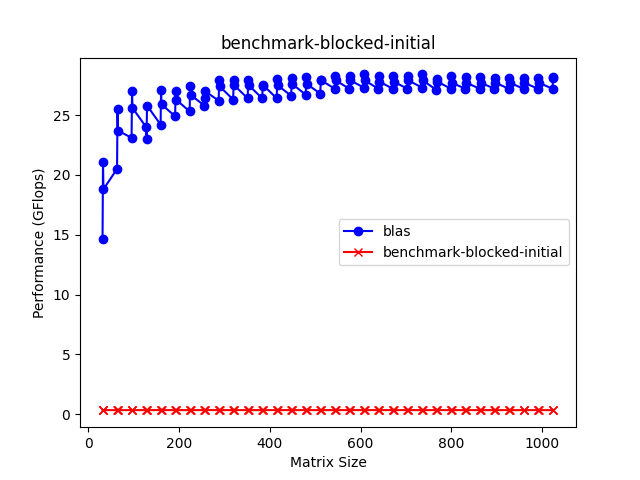

初始版本 1 是助教提供的分块算法，它实现的思路是：对 C 矩阵进行分块，得到一个 C 的子矩阵，然后从 A 矩阵的行和 B 矩阵的列里面按照块来进行计算。

选择 C 子矩阵方法的好处：C 矩阵的局部性很好，可以先把数组打包，然后不断更新 C 的结果，最后再写回 C 矩阵；坏处：A 和 B 矩阵局部性较差，而且一个行，一个列，需要转置操作，耗费时间。

### 循环优化版本 2（5.86 GFlops，`sgemm-blocked-loop.c`）

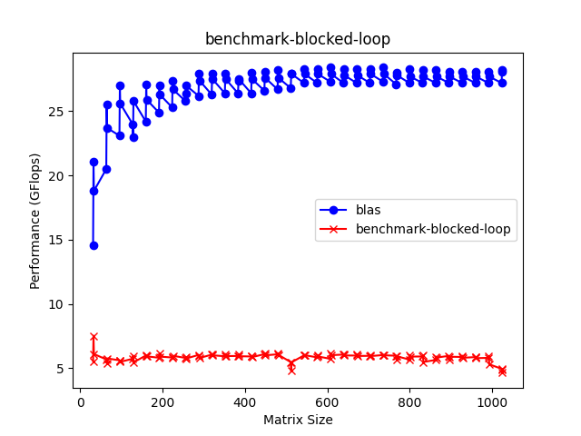

对上面的版本 1 进行循环次序的优化，把连续访问放到内层循环，就可以得到 `sgemm-blocked-loop.c` 中代码。可以看到，优化后性能提升很多，超过了 naive 三层循环的实现。

### 数组打包版本 3（6.33 GFlops，`sgemm-blocked-pack.c`）

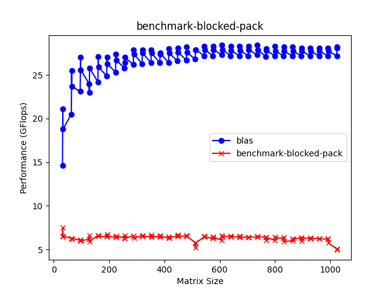

对版本 2 继续改进，因为循环中，对 B 的访问较差，所以对 B 进行数组打包，然后访问的时候可以得到更好的局部性。

### 数组打包版本 4（8.18 GFlops，`sgemm-blocked-pack-c.c`）

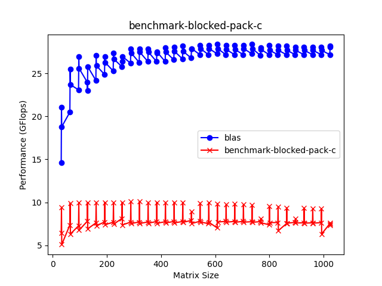

对版本 3 继续改进，因为 C 在计算的时候可以一直累加，所以可以先对 C 进行数组打包，这样写入 C 的局部性会更好。

### 编译优化版本 5（11.63 GFlops，`sgemm-blocked-const.c`）

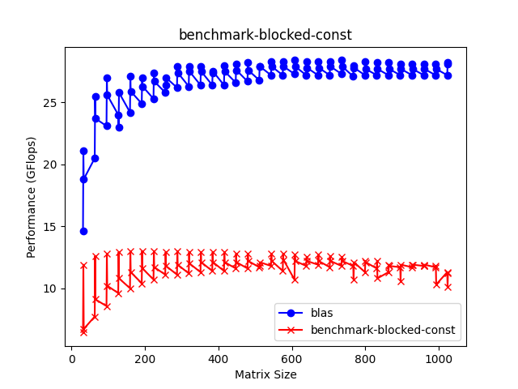

在这一步的时候，通过观察汇编可以发现，编译器进行了向量化，但是向量化指令太分散，有很多分支判断，分析后认为是因为子矩阵的大小不确定，因此编译器不能完全展开内层循环为向量指令。所以，我把函数复制了一份，并且设置矩阵大小为完整的块大小，并且进行判断：如果这个子矩阵是满的，就用优化版本；如果不是满的，就用通用版本。

这样实现以后，可以看到编译器已经可以生成密度较高的向量化指令：

```asm
ldp     q4, q3, [x0, #64]
ldp     q2, q1, [x0, #96]
fmla    v16.4s, v24.4s, v0.s[0]
fmla    v7.4s, v23.4s, v0.s[0]
stp     q16, q7, [x0]
fmla    v6.4s, v22.4s, v0.s[0]
fmla    v5.4s, v21.4s, v0.s[0]
stp     q6, q5, [x0, #32]
fmla    v4.4s, v20.4s, v0.s[0]
fmla    v3.4s, v19.4s, v0.s[0]
stp     q4, q3, [x0, #64]
fmla    v2.4s, v18.4s, v0.s[0]
fmla    v1.4s, v17.4s, v0.s[0]
```

因此得到了比较明显的性能提升。

在这个版本上走了很多努力，但是没有得到更好的性能。于是，在网上阅读了 GotoBLAS 的论文以及 [How To Optimize GEMM](https://github.com/flame/how-to-optimize-gemm) 文档，得到了新的思路：

在上面的实现过程中，主要是针对缓存优化，在内部实现中做了一些向量化的计算，但如果更激进一些，我们直接把一个块的所有数据保存在寄存器内，这样可以更加节省访存的次数和时间，并且提高计算密度；但同时，由于寄存器大小与个数有限，如果对个位数边长的子矩阵，就没法充分利用缓存。在阅读并理解了 GotoBLAS 的思路以后，得知可以采用两级分块的方式：第一级分块对应一级缓存，第二级分块对应寄存器。按照这个思路，重新实现了下面的一系列算法。

### 两级分块算法 6（7.63 GFlops，`sgemm-blocked-two-level.c`）

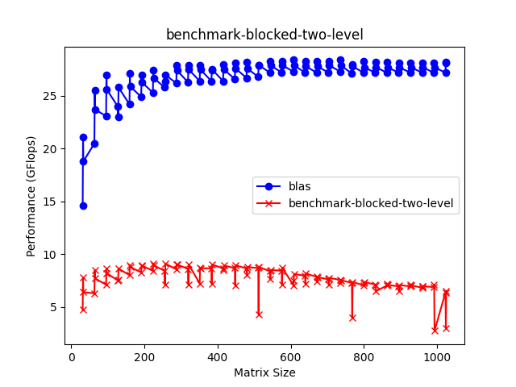

这一步中，第一级块大小设为 32，第二级块大小设为 4；其中第一级块大小最好是第二级块大小的整数倍，在 How To Optimize Gemm 中，它针对的是 SSE 指令集，因此采用了 4x4 的矩阵大小，于是我在这里也先采用 4x4，后面会提到为何换成了 8x8。

这样实现以后，性能不升反降，这也很正常，因为后续还有很多优化可以做。

### 对 A 分块算法 7（2.95 GFlops，`sgemm-blocked-a.c`）

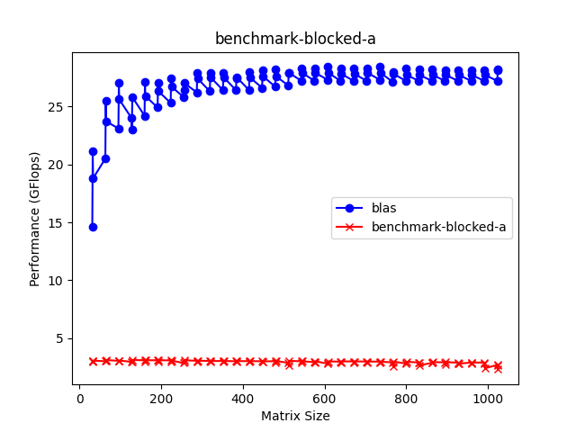

通过阅读 GotoBLAS 算法发现，它第一级分块针对的是 A 矩阵，而不是 C 矩阵。对于 A 矩阵中的块 (i, j)，仔细思考可以发现，它对应需要计算的是 B 中第 j 行，计算结果是 C 中的第 i 行，可以看到都是长的行，而不像前面用 C 分开中会出现一行一列的情况，这为后面进行优化，减少转置是有帮助的。

于是按照这个思路修改了算法 6，得到了算法 7，可以看到性能继续下降了，不过没事，通过一步步的优化，我们可以把这个性能找回来，并且超过之前对 C 分块得到的最好结果。

### 对 C 数组打包算法 8（6.98 GFlops，`sgemm-blocked-a-pack-c.c`）

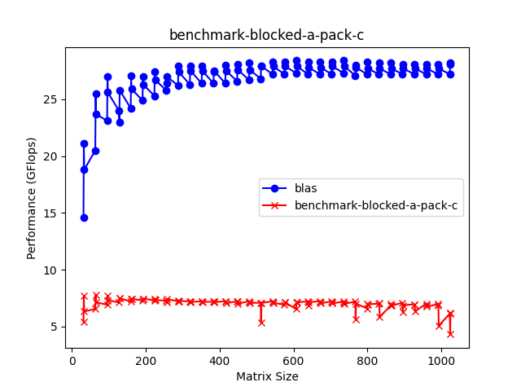

接下来进行比较通用的优化算法，对 C 数组打包，得到了好一些的性能，不过还是差了一些。

### 对 A 数组打包算法 9（9.21 GFlops，`sgemm-blocked-a-pack-a.c`）

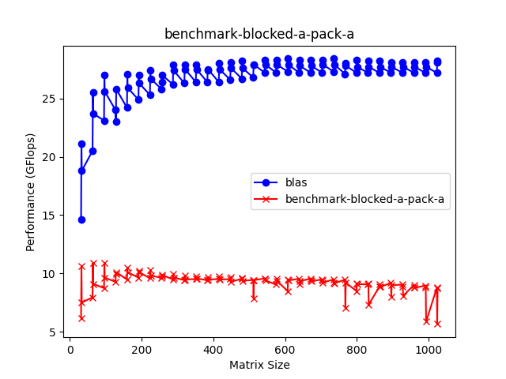

打包一次不够，那就继续打包，这次是对 A 数组打包，又得到了一些性能提升，不错。

### 对 B 数组打包算法 10（9.89 GFlops，`sgemm-blocked-a-pack-b.c`）


打包两次不够，那就打包第三次，这次是对 B 数组打包，现在已经达到接近 10 GFlops 的性能了，接下来分析瓶颈在哪里。

首先，我继续阅读了汇编，发现内层向量化较好，因为块大小是固定的四，一次循环四条 `fmla` 指令计算 16 个浮点数乘加，看起来不错，但距离 BLAS 库的性能还是很远。我用 perf 工具看了一下，大部分时间都在访存上，说明计算密度还是太低。接着，我在 perf 里面看到了 BLAS 的 sgemm 汇编，发现 BLAS 库里面有大量的 `fmla` 指令，并且用了很多的寄存器，这时候我就知道，我还是得用 intrinsics，不然无法与之匹敌。

### intrinsics 初步算法 11（10.26 GFlops，`sgemm-blocked-intrinsics.c`）

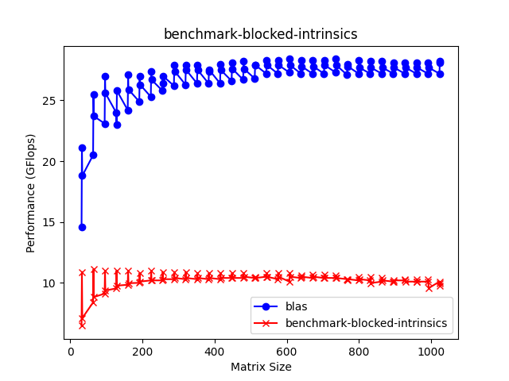

由于之前有写 x86 intrinsics 的经验，这次我也是首先找到了 ARM 的 intrinsics [文档网页](https://developer.arm.com/architectures/instruction-sets/intrinsics)，可以快速地找到我想要的文档。那么，首先要做的就是把 4x4 矩阵运算变成一系列的向量计算，因为一个 128 位寄存器刚好可以放 4 个单精度浮点，所以我直接按照内层循环翻译为向量指令运算，一列对应一个向量，不修改计算过程，相当于手动进行了向量化和循环展开。性能提升也不错，达到了 10.26 GFlops。

此时的代码和之前编译器优化出来的代码其实差不了多少，只不过密度上会稍微好一些。这时我又想到之前 BLAS 库上看到了满屏幕的 `fmla` 指令，我就算了这么一笔账：

AArch64 NEON 有 32 个 128 位向量寄存器，可以存放 128 个单精度浮点。我现在只用了 4x4=16 个，那如果扩大到 8x8=64 呢？我估算了一下，8x8 情况下连续的 `fmla` 应该是 16 个，对照了一下 BLAS 库的汇编，发现正好是 16 个，说明它也是用了 8x8 的分块来实现。

### 8x8 intrinsics 算法 12（13.75 GFlops，`sgemm-blocked-intrinsics-8x8.c`）

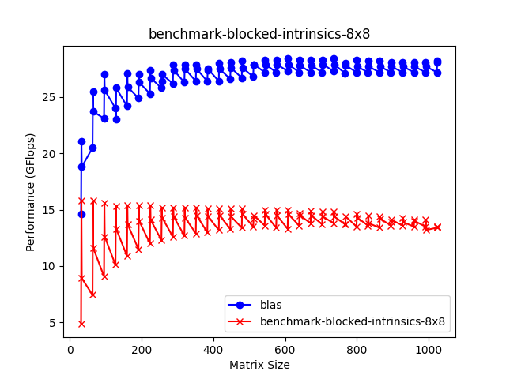

按照 8x8 实现以后，性能提高到了 13.75 GFlops，很不错。这时候，继续增大第二级块大小不可取，因为没有那么多寄存器了，再多又会写到内存里了。于是开始尝试优化我编写的 intrinsic，因为之前的代码是直接从循环对应过来的，可能并不是最优的。最重要的一点是计算指令密度：只有计算指令密度提高了，访存指令密度降低了，性能才可能提高。

### intrinsics load 优化算法 13（15.63 GFlops，`sgemm-blocked-intrinsics-8x8-load.c`）

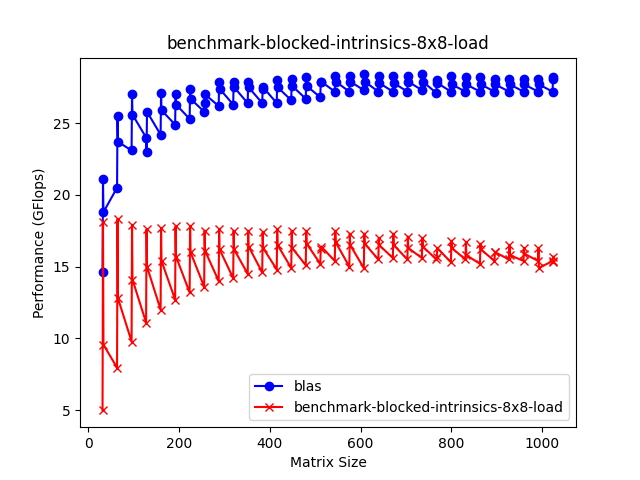

观察汇编和代码后发现，load 指令还是多条指令实现的，但其实这一部分也可以一次性 load 进来，然后每次计算取不同的 lane。换句话说，就是用了更精简的 intrinsics 组合，提高了性能。

### intrinsics 转置算法 14（18.71 GFlops，`sgemm-blocked-intrinsics-8x8-transpose.c`）

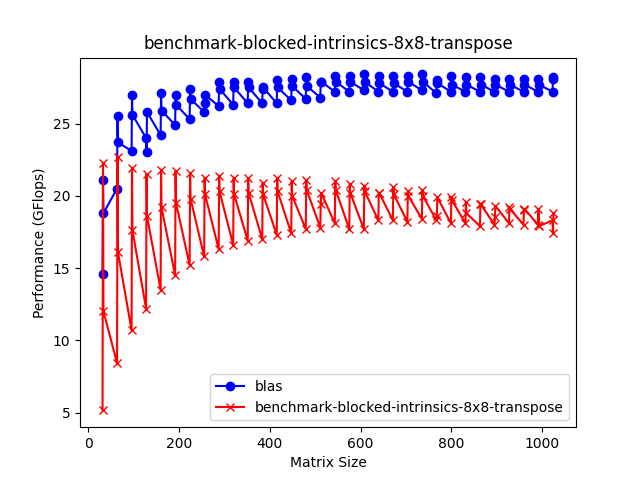

我继续采用 perf 工具，发现除了循环内部的 load 时间消耗大以外，循环前的数组打包和转置消耗的时间也很久，而且编译器为了用向量指令加速转置的过程，也用了不少 zip/unzip 指令。思考以后发现，如果我每个向量寄存器保存的是行，而不是原来的列，所有的计算都转置一下，相当于 A 和 B 进行了交换，那么我就不需要对 C 进行转置了。重新修改了代码逻辑以后，得到了不错的性能，已经可以看到曙光了。

### intrinsics 调优算法 15（24.60 GFlops，`sgemm-blocked-intrinsics-8x8-tuning.c`）

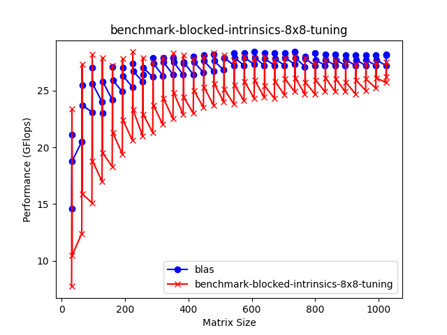

最后，再调整一下参数，把第一级块的大小适当增大，就得到了更好的性能。但是发现，当矩阵大小不是块大小的整数倍的时候（比如 129），由于之前对边界情况的处理就是回退到 naive 的实现，在这种情况下性能就会有明显的损失，接下来要优化这种情况

### 对齐算法 16（25.87 GFlops，`sgemm-blocked-intrinsics-8x8-align.c`）

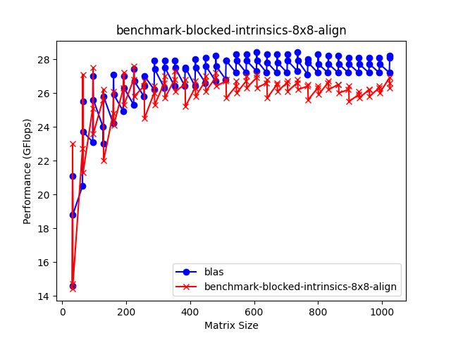

虽然最后多出来的数据不满一整个矩阵，但我也可以将原矩阵填充到块大小，只不过写回数据的时候，注意不要写入原本没有的数据。

### 最终版本 17（26.51 GFlops，`sgemm-blocked.c`）

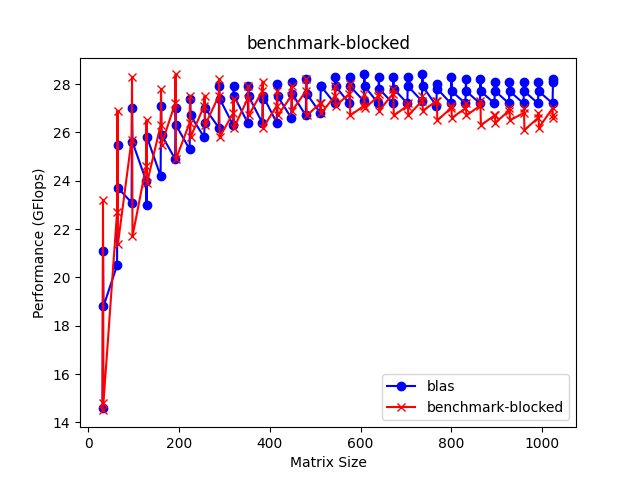

最终删去了一些无用的代码，又调整了一下参数，得到了最优的结果。

## 讨论

实际上尝试过的优化不止上面见到的这些，其他的一些优化，比如预取等等，虽然尝试了，但可能因为没有找到正确的实现方法，没有显著的效果。

上面的数据都是用 `run.sh` 运行得到。为了免除不同机器的性能差异，指定了一台机器作为测试。

## 额外的加分

不做了！勇当反卷先锋。

## 总结

这次实验挺有意思的，之前都是直接用 BLAS 库来算矩阵运算，但是没有实际优化过 GEMM，学到了很多，才明白原来有这么多的矩阵运算优化方法。遗憾就是没有超过 BLAS 的实现，我觉得以 OpenBLAS 的水平来说，应该不是最优的，估计会有同学性能超过 BLAS。